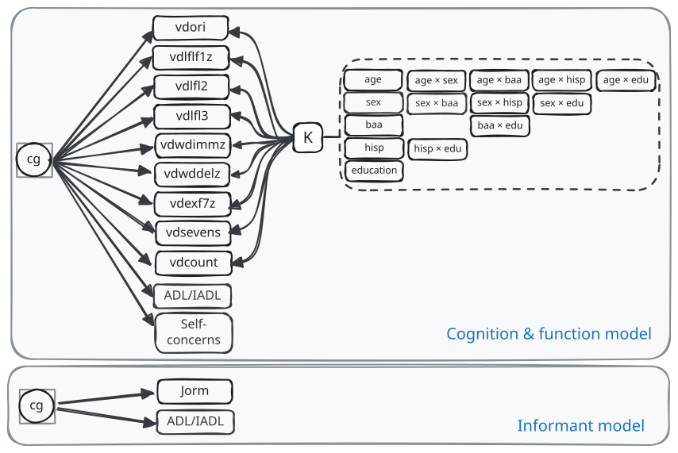

## PMM: final model

:::: {.columns}
::: {.column width="58%"}
{width="100%"}
:::

::: {.column width="42%"}

`cg` is the cognitive class (Normal, MCI, Dementia). In calibration it is fixed to the HRS/HCAP Algorithm class.

`K` holds the fixed coefficients from the robust norms group. They adjust the nine cognitive tests for demographics. They do not predict class.

Two models: a cognition and function model for people with cognitive tests, and an informant model (Jorm IQCODE and ADL/IADL items) for people without them.

The final model has no latent cognition factor. Each test is a direct indicator of class, which gave better agreement with the HRS/HCAP Algorithm.

:::
::::

