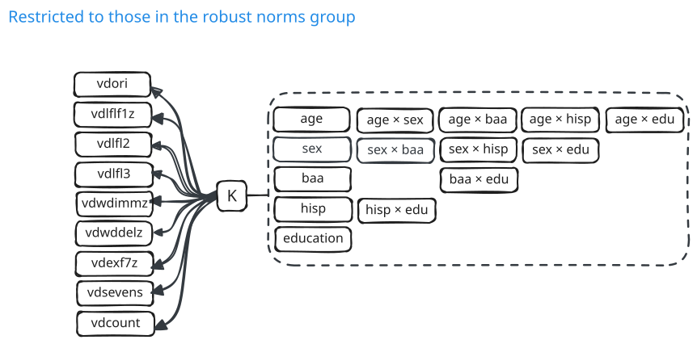

## PMM: covariate adjustment

:::: {.columns}
::: {.column width="58%"}
{width="100%"}
:::

::: {.column width="42%"}

Each cognitive test on age, sex, race, ethnicity, education, and their interactions in the HRS/HCAP robust norms sample.

The regression coefficients describe expected test performance for a person free of conditions that affect cognition.

We save these coefficients and fix them in the PMM. 

This step matches the norming step of the HRS/HCAP Algorithm.

:::
::::

