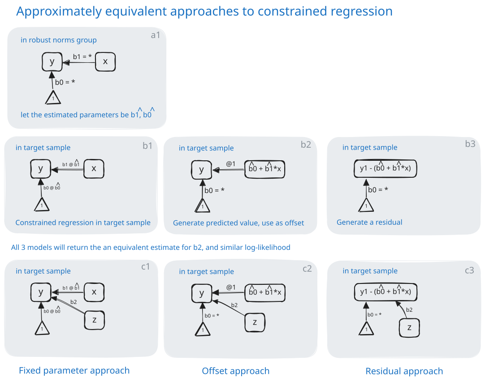

## PMM: covariate adjustment

:::: {.columns}
::: {.column width="58%"}
{width="100%"}
:::

::: {.column width="42%"}

Three methods give the same adjustment: a residual from the norms-group equation, an offset, or fixed regression coefficients.

The HRS/HCAP Algorithm uses residuals. The PMM uses fixed coefficients, because five of the nine Core cognitive tests are ordinal (ordered categories), and residuals do not work for ordinal tests.

:::
::::

