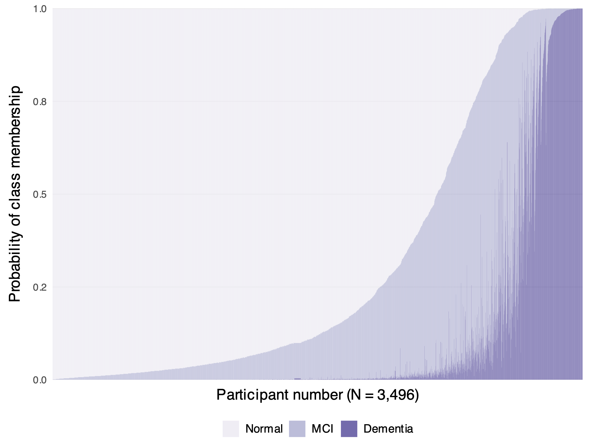

## PMM: class probabilities

{fig-align="center" height="520"}

Each vertical bar is one HRS/HCAP participant, with the probabilities of Normal, MCI, and Dementia stacked. Participants are sorted by probability.

