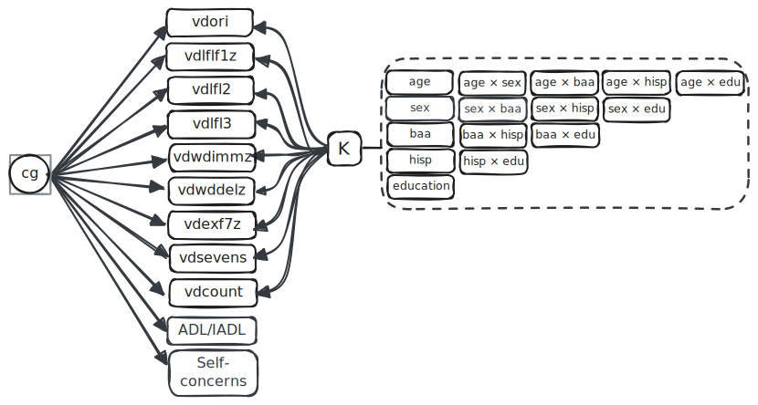
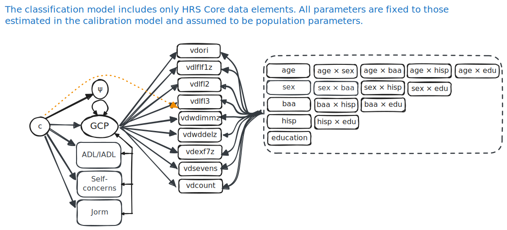

## New approach: profile mixture modeling

- PMM is a mixture-modeling approach that uses the joint pattern of multiple observed indicators to define latent profiles and estimate the probability that each person belongs to each profile.
- In this project, PMM is trained against known HRS/HCAP actuarial classifications, with cognitive indicators adjusted using fixed parameters from the robust norms group, and then applied to HRS Core as a probabilistic classification rule.

## PMM structure

:::: {.columns}
::: {.column width="58%"}
{width="100%"}
:::

::: {.column width="42%"}

`cg` is a latent class variable (a known class in the HRS/HCAP calibration sample, and an unknown class in the HRS Core application sample) that is predicted by a set of cognitive indicators (the nine indicators listed below) that are adjusted for sociodemographics using fixed parameters from the robust norms group. The classes correspond to normal cognition, MCI/CIND, and dementia.

`K` is a matrix of fixed regression coefficients used to adjust cognitive indicators for sociodemographics. These parameters are estimated in the robust norms sample and then loaded into the classification model. For the nine cognitive indicators and fifteen sociodemographic terms, this contributes $9 \times 15 = 135$ coefficients. This normative reference group fixed-parameter regression is equivalent to the approach used by Manly et al (2022) (i.e., regression adjustment of cognitive domains using the normative reference group). 

Cognitive indicators include `vdori`, Orientation to time; `vdlfl1z`, Animal naming; `vdlfl2`, naming two items; `vdlfl3`, President & vice-president; `vdcount`, Count backwards from 20; `vdsevens`, Serial sevens; `vdwdimmz`, Immediate word recall; `vdwddelz`, Delayed word recall; `vdexf7z`, Number series.

:::
::::

## PMM structure (where we started)

:::: {.columns}
::: {.column width="58%"}
{width="100%"}
:::

::: {.column width="42%"}

We started with a model that include a latent general cognitive performance factor (GCP), but that model resulted in poor classification, and after consideration, the use we had in mind did not require the parsimony of a general factor as long as it was only applied to core data (with the same cognitive indicators). 

We also thought we could include the Jorm in this model, but the missing data pattern made that overly complicated. We address informant data (available only for those with no cognitive data) separately. We build a separate PMM for the informant data (a PMM model so we can have a probabilistic classification result), and then combine the results of the two PMMs using whichever is appropriate for the respondent.

:::
::::

### How our approach differs from LDA and QDA

LDA and QDA (Linear and quadratic discriminant analysis, respectively) classify people from the joint distribution of multiple indicators, but they are usually framed for continuous Gaussian variables. In LDA, classes differ in their means, but they are assumed to share the same covariance matrix. In QDA, both the class means and the class-specific covariance matrices are allowed to differ. Our PMM is closer to a generative LDA/QDA family model than to a simple discriminative classifier, because it models the distribution of the indicators within class and then computes posterior class probabilities.

For the cognitive indicators, PMM handles the indicator means through fixed sociodemographic adjustment terms estimated in the robust norms group, plus class-specific location shifts in the classification model. That means expected performance is anchored to the normative reference group rather than re-estimated in the target sample. For the indicator variances and covariances, the current PMM is LDA-like: residual variability is constrained to be equal across classes. A QDA-like extension would allow those residual variance-covariance parameters to differ by class. PMM is also more flexible than classical LDA or QDA because several indicators are ordinal or discrete, so class separation is represented through latent-response means, thresholds, and shared residual structure rather than only through multivariate Gaussian means and variances on the observed score scale.

### How our approach differs from predictive modeling

Many predictive models are optimized to maximize classification accuracy in the sample at hand, even if that means learning direct associations of sociodemographics with class membership or relying on patterns that are difficult to transport or interpret. Our PMM is built for a different goal: it separates measurement from classification, anchors expected cognitive performance in a normative reference group, and then classifies people according to how their observed indicator pattern departs from that demographically adjusted expectation. In that sense, PMM is not just trying to predict who is in each class; it is trying to represent a transportable classification rule with a measurement interpretation that remains close to the logic of the actuarial approach.

