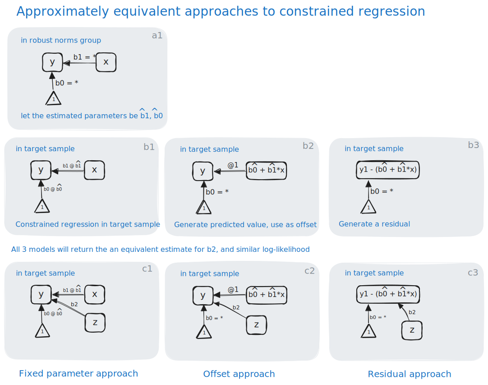

## Covariate adjustment

:::: {.columns}
::: {.column width="58%"}
{width="100%"}
:::

::: {.column width="42%"}

How to handle covariate adjustment, in a way consistent with what we did in Manly et al (2022), requires new methodology for the PMM. In Manly et al (2022), we adjust observed (continuous) cognitive indicators for covariates in the robust norms group (panel a1). Then we include in future analyses using the target (overall) sample the residual of observed cognition and expected cognition given the regression models defined in the robust norms group (panels b3, c3, the _residual_ approach). 

Approximately equivalent approaches to handling expectations-given-covariates-in-robust-norms-group would be to use the robust norms group defined regression parameters as fixed parameters in the target sample (panels b1, c1, the _fixed parameter_ approach) or to include computed expected scores for each person, each outcome variable (y) given covariates and regression parameters defined in the robust norms group, and use these as an _offset_ (regress observed on expected with coefficient fixed at 1; panels b2, c2).

All three of these approaches will return equivalent relationships between an external variable (z; panels c1-c3) and the cognitive variable. 

We chose the fixed regression parameter approach (b1, c1) rather than the residual approach, because both the residual approach and the offset approach do not translate well to the case where the outcomes (y's) are categorical. 

:::
::::

